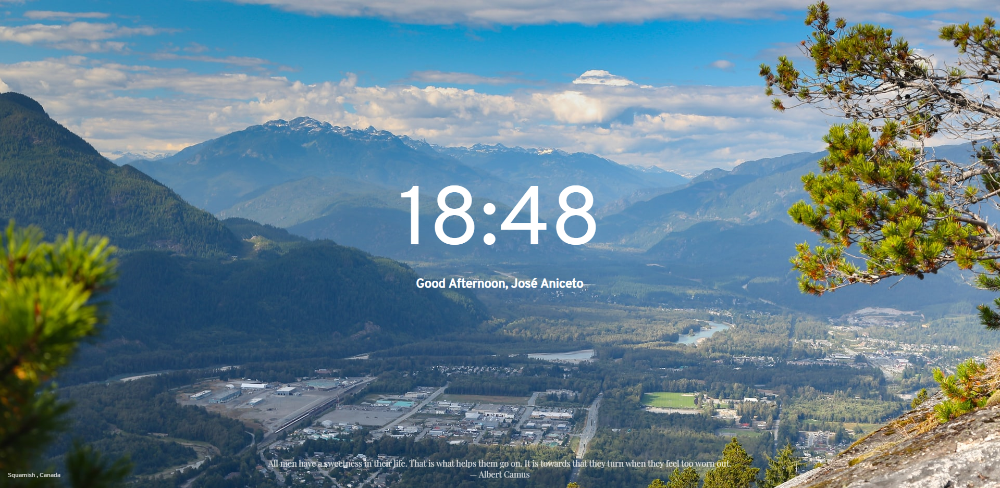

     
    

<h1 align="center">murus</h1>

**murus** is a chrome extension that substitutes the new tab page with beautifull images from several sources at your choice. It is heavilly inspired by the awesome [Momentum](https://chrome.google.com/webstore/detail/momentum/laookkfknpbbblfpciffpaejjkokdgca?hl=pt-pt) extension.

## Installing

1) Download the files and unzip;
2) Enable the `Developer Mode` under the chrome extension management window;
3) Click the `Load Unpacked` and import the local **murus** folder.
